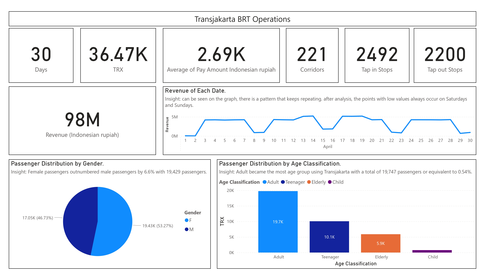
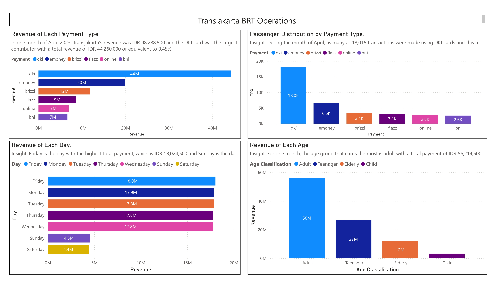
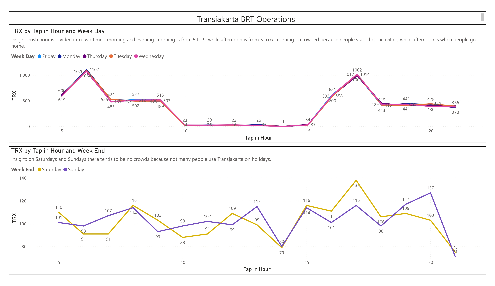

# Transjakarta BRT Operations Analysis

This project analyzes Transjakarta Bus Rapid Transit (BRT) operations using two main tools:

- 📊 **Power BI Dashboards** for visual storytelling and executive insights  
- 🧠 **Python Data Science Notebook** for data cleaning, exploration, and deeper analytical understanding

---

## 🔧 Tools Used

- **Power BI Desktop** – for dashboard creation  
- **Python (Jupyter Notebook)** – for data wrangling and analysis  
- **Pandas, Matplotlib, Seaborn** – for data science and visualizations

---

## 📊 Power BI Dashboard Summary

Power BI dashboards provide a high-level overview of Transjakarta performance metrics.

### Key Metrics:
- 💳 **36.47K** Transactions in April  
- 💰 **98M IDR** Revenue  
- 🚌 **221 Corridors**, **2492 Tap-in Stops**, **2200 Tap-out Stops**  
- 💵 **2.69K IDR** Avg. Pay Amount  

### Key Insights:
- 👩‍🦰 **Gender Distribution**: Female passengers outnumber males by 6.6%  
- 👥 **Age Classification**: Adults form the majority of riders (19.7K)  
- 📆 **Revenue by Date**: Lowest on weekends (Saturday & Sunday)  
- 💳 **Revenue by Payment Type**: DKI cards are the most used (44M IDR)  
- 🗓️ **Peak Days**: Friday generates the highest revenue (18M IDR)  
- ⏰ **Rush Hours**: 5–9 AM and 5–6 PM on weekdays are the busiest  

---

## 📸 Screenshots

| Dashboard Page                        | Preview                          |
|-------------------------------------|--------------------------------|
| **Transjakarta Overview**            |       |
| **Revenue & Payment Breakdown**      |  |
| **Transaction Patterns & Rush Hours**|  |

> ⚠️ If images don't show, confirm the filenames and locations inside the `assets/` folder.

---

## 📈 Data Science Analysis – `BRTanalysis.ipynb`

This notebook supports the dashboard with deeper data insights and preprocessing.

### Sections:
- **Background**: Outlines the purpose and challenges of Transjakarta  
- **Data Loading**: Imports raw CSV data of passenger transactions  
- **Cleaning**: Handles nulls, parses dates, extracts time features  

### Exploratory Analysis (EDA):
- Gender and Age distribution  
- Tap-in hour behavior (weekday vs. weekend)  
- Revenue trends by age group and payment method  
- Daily revenue fluctuations  

### Sample Insights:
- “Friday has the highest total revenue (18.0M IDR)”  
- “The adult group generates the most revenue (56.2M IDR)”  

---

## 🚀 How to Use

1. Open the Power BI `.pbix` file to explore interactive dashboards.  
2. Run the `BRTanalysis.ipynb` notebook in Jupyter/Colab for data insights.  
3. View screenshot summaries in the `assets/` folder.

---

## 🤝 Contributing

Fork this repo, suggest improvements, or submit pull requests!

---

## 📄 License

Licensed under the MIT License.

---

**Made with ❤️ by [mostafarahimtaha](https://github.com/mostafarahimtaha)**
